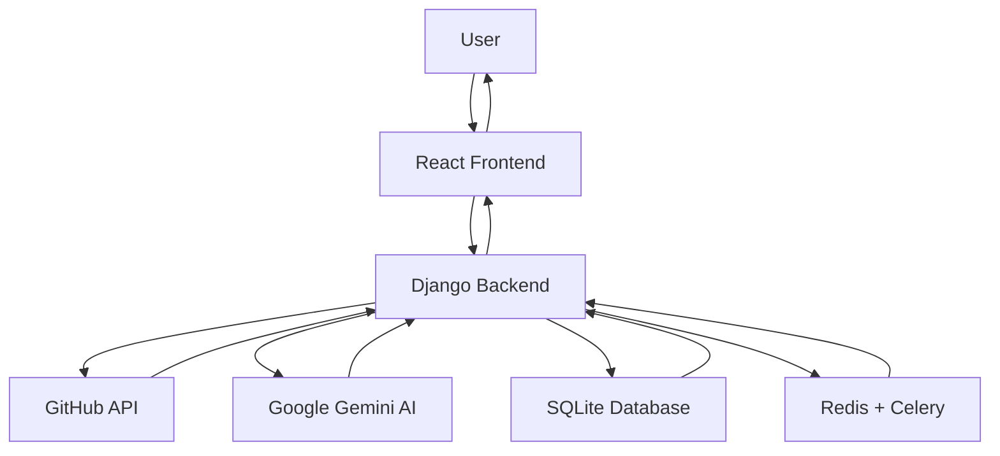

# CodeDoc Backend - Complete Technical Explanation

## 🎯 **High-Level Overview**

### **What is CodeDoc?**
CodeDoc is an AI-powered documentation generator that connects to your GitHub repositories and automatically creates professional documentation for your Python code. Think of it as your personal documentation assistant that reads your code and explains what it does in plain English.

### **Backend Purpose**
The backend serves as the brain of CodeDoc. It:
- **Authenticates users** via GitHub OAuth (no passwords needed!)
- **Fetches code** from GitHub repositories using their API
- **Analyzes Python files** using Abstract Syntax Trees (AST)
- **Generates documentation** using Google's Gemini AI
- **Manages everything asynchronously** so users don't wait

### **Frontend ↔ Backend Connection**
```
React Frontend (Port 5173) ←→ Django Backend (Port 8000)
    ↓
1. User clicks "Login with GitHub" 
2. Frontend redirects to Django OAuth endpoint
3. Django handles GitHub authentication
4. Django sends token back to React
5. React stores token and makes API calls
6. Django processes requests and returns JSON data
```

### **Simple System Flow**


---

## 📁 **Project Structure Breakdown**

### **Root Level**
```
backend/
├── codedoc_main/          # Main Django project settings
├── accounts/              # User authentication & profiles
├── repositories/          # Core business logic
├── templates/             # HTML templates (minimal usage)
├── manage.py             # Django management script
└── db.sqlite3            # Database file
```

### **codedoc_main/ - Project Configuration**
Think of this as the "control center" of your Django application.

- **`settings.py`** - All configuration (database, APIs, security)
- **`urls.py`** - Main URL routing (like a traffic director)
- **`wsgi.py`** - Web server interface (for production)
- **`asgi.py`** - Async server interface (for real-time features)
- **`celery.py`** - Background task configuration

### **accounts/ - User Management**
Handles everything related to users and authentication.

- **`models.py`** - User profile data structure
- **`views.py`** - API endpoints for login, signup, profile
- **`adapters.py`** - Custom GitHub OAuth behavior
- **`utils.py`** - Helper functions for GitHub sync
- **`signals.py`** - Automatic actions when users are created

### **repositories/ - Core Business Logic**
This is where the magic happens! All repository and documentation features.

- **`models.py`** - Repository, File, and Job data structures
- **`views.py`** - API endpoints for all repository operations
- **`services.py`** - GitHub API integration
- **`gemini_services.py`** - AI documentation generation
- **`tasks.py`** - Background jobs (Celery)
- **`context_enhancer.py`** - Code analysis using AST
- **`ast_utils.py`** - Python code parsing utilities
- **`simple_batch_processor.py`** - Batch processing for API efficiency

---

## 🔄 **Flow of Execution - Step by Step**

### **Example: User Generates Documentation**

Let's trace what happens when a user clicks "Generate Documentation":

#### **1. Frontend Request**
```javascript
// React sends POST request
fetch('/api/repositories/123/generate-docs/', {
  method: 'POST',
  headers: { 'Authorization': 'Token abc123' }
})
```

#### **2. Django URL Routing**
```python
# urls.py routes the request
path('<int:repository_id>/generate-docs/', views.generate_documentation)
```

#### **3. View Function Processing**
```python
# views.py - generate_documentation function
@api_view(['POST'])
@permission_classes([permissions.IsAuthenticated])
def generate_documentation(request, repository_id):
    # 1. Validate user owns this repository
    # 2. Check if documentation job already exists
    # 3. Create new DocumentationJob record
    # 4. Queue background task
    # 5. Return job ID immediately
```

#### **4. Background Task Execution**
```python
# tasks.py - Celery processes the job
@shared_task
def generate_repository_documentation(job_id, repository_id):
    # 1. Fetch Python files from GitHub
    # 2. Analyze code structure (AST)
    # 3. Generate docs using Gemini AI
    # 4. Save results to database
```

#### **5. Response Chain**
```
Database ← Task Results
   ↓
Django View ← Database Query
   ↓
JSON Response → Frontend
   ↓
User sees updated documentation
```

### **Django REST Framework (DRF) Pattern**
Every API request follows this pattern:
```
URL → View → Permission Check → Serializer → Model → Database
                ↓
Database → Model → Serializer → JSON → Frontend
```

---

## 🚀 **Core Features & Their Flows**

### **1. GitHub Authentication**
**What it does:** Allows users to login with their GitHub account instead of creating passwords.

**Flow:**
1. User clicks "Login with GitHub" on frontend
2. Frontend redirects to `/auth/github/login/`
3. Django redirects to GitHub OAuth
4. User authorizes on GitHub
5. GitHub sends user back to Django with auth code
6. Django exchanges code for access token
7. Django creates/updates user account
8. Django redirects to frontend with authentication token

**Key Methods:**
- `CodeDocSocialAccountAdapter.pre_social_login()` - Security checks
- `github_oauth_callback()` - Handles successful OAuth
- `sync_github_profile_for_user()` - Updates user info

### **2. Repository Synchronization**
**What it does:** Fetches user's GitHub repositories and stores them locally.

**Flow:**
1. Frontend requests repository sync
2. Django calls `GitHubService.sync_repositories()`
3. Service fetches repos from GitHub API
4. Creates/updates `Repository` records in database
5. Returns repository list to frontend

**Key Methods:**
- `GitHubService.fetch_repositories()` - GitHub API call
- `GitHubService.sync_repositories()` - Database sync
- `sync_repositories()` view - API endpoint

### **3. File Discovery**
**What it does:** Finds all Python files in selected repositories.

**Flow:**
1. User selects repositories for documentation
2. Django calls `GitHubService.fetch_repository_files()`
3. Service recursively explores repository structure
4. Identifies Python files (.py extension)
5. Creates `RepositoryFile` records
6. Marks Python files as `is_supported=True`

**Key Methods:**
- `GitHubService.fetch_repository_files()` - Recursive file discovery
- `sync_selected_repositories_files()` - Batch file sync

### **4. Code Analysis (AST)**
**What it does:** Analyzes Python code structure to understand functions, classes, and complexity.

**Flow:**
1. System fetches Python file content from GitHub
2. `ast_utils.py` parses code into Abstract Syntax Tree
3. `context_enhancer.py` extracts meaningful information:
   - Function names, parameters, return types
   - Class names, methods, inheritance
   - Import statements and dependencies
   - Code complexity scores
4. Creates rich context for AI documentation

**Key Methods:**
- `extract_enhanced_context()` - Main analysis function
- `calculate_function_complexity()` - Complexity scoring
- `infer_file_purpose()` - Determines file type/purpose

### **5. AI Documentation Generation**
**What it does:** Uses Google Gemini AI to generate human-readable documentation.

**Flow:**
1. System creates documentation job in database
2. Celery task processes files in batches
3. For each function/class without docstring:
   - Creates detailed prompt with context
   - Sends to Gemini AI API
   - Receives generated documentation
   - Stores in database
4. Updates job progress in real-time
5. Combines all documentation into final result

**Key Methods:**
- `GeminiDocService.generate_function_documentation()` - AI generation
- `generate_repository_documentation()` - Celery task
- `SimpleBatchProcessor` - Rate limiting and batching

---

## 📚 **Libraries & Why They're Used**

### **Core Django Stack**
- **Django 5.1.4** - Web framework that handles HTTP, database, security
- **Django REST Framework** - Converts Django into a powerful API server
  - *Why chosen:* Built-in serialization, authentication, permissions
  - *Alternative:* Flask (too minimal for our needs)

### **Authentication & Social Login**
- **django-allauth** - Handles GitHub OAuth integration
  - *Why needed:* Users don't want to create another password
  - *Benefits:* Automatic GitHub token management, secure OAuth flow
- **dj-rest-auth** - REST API endpoints for authentication
- **rest_framework.authtoken** - Token-based API authentication

### **Background Tasks**
- **Celery** - Processes documentation generation in background
  - *Why needed:* AI generation takes 30+ seconds, can't block UI
  - *How it works:* Queues tasks in Redis, processes asynchronously
- **Redis** - Message broker for Celery
  - *Why chosen:* Fast, reliable, perfect for task queues

### **External APIs**
- **requests** - HTTP client for GitHub API calls
  - *Usage:* Fetching repositories, files, user data
- **google-generativeai** - Google Gemini AI client
  - *Usage:* Generating documentation from code analysis

### **Code Analysis**
- **ast (built-in)** - Python Abstract Syntax Tree parser
  - *Why needed:* Understand code structure without executing it
  - *Usage:* Extract functions, classes, complexity metrics

### **Configuration & Security**
- **python-decouple** - Manages environment variables
  - *Why needed:* Keep API keys and secrets out of code
- **django-cors-headers** - Handles cross-origin requests
  - *Why needed:* Frontend (port 5173) → Backend (port 8000)

---

## ⚠️ **Error Handling & Monitoring**

### **Error Catching Strategy**
The system uses multiple layers of error handling:

#### **1. View Level (User-Facing Errors)**
```python
try:
    # Process request
    return Response({'success': True})
except ValidationError as e:
    return Response({'error': str(e)}, status=400)
except Exception as e:
    logger.error(f"Unexpected error: {str(e)}")
    return Response({'error': 'Internal server error'}, status=500)
```

#### **2. Service Level (API Integration Errors)**
```python
def fetch_repositories(self):
    try:
        response = requests.get(url, headers=headers)
        if response.status_code != 200:
            raise Exception(f"GitHub API error: {response.status_code}")
    except requests.RequestException as e:
        logger.error(f"Network error: {str(e)}")
        raise Exception("Failed to connect to GitHub")
```

#### **3. Task Level (Background Job Errors)**
```python
@shared_task(bind=True, max_retries=2)
def generate_repository_documentation(self, job_id, repository_id):
    try:
        # Process documentation
    except Exception as e:
        # Mark job as failed
        job.mark_as_failed(str(e))
        # Retry if not max retries
        raise self.retry(countdown=60)
```

### **Logging System**
```python
import logging
logger = logging.getLogger(__name__)

# Different log levels used throughout:
logger.info("Processing started")     # General info
logger.warning("Rate limit hit")      # Potential issues
logger.error("API call failed")       # Actual errors
logger.debug("Variable value: X")     # Development info
```

### **Retry Logic**
- **Celery tasks**: Automatic retry with exponential backoff
- **API calls**: Manual retry for rate limiting
- **Database operations**: Django's built-in transaction rollback

---

## 🗄️ **Database & Models**

### **How Models Map to Database Tables**

Django's ORM (Object-Relational Mapping) automatically converts Python classes to database tables:

```python
class Repository(models.Model):
    name = models.CharField(max_length=200)
    user = models.ForeignKey(User, on_delete=models.CASCADE)
```

Becomes SQL table:
```sql
CREATE TABLE repositories (
    id INTEGER PRIMARY KEY,
    name VARCHAR(200),
    user_id INTEGER REFERENCES auth_user(id)
);
```

### **Key Models Explained**

#### **User & UserProfile**
```python
# Built-in Django User model stores basic info
User: username, email, password, is_active

# Our custom UserProfile extends it
UserProfile: github_username, github_id, avatar_url, style_profile
```

#### **Repository**
```python
Repository: 
    - github_id (unique identifier from GitHub)
    - name, full_name, description
    - user (who owns this repo)
    - is_selected (chosen for documentation)
    - stars_count, forks_count (GitHub metrics)
```

#### **RepositoryFile**
```python
RepositoryFile:
    - repository (which repo this file belongs to)
    - path, name, extension
    - is_supported (can we generate docs for this?)
    - content_sha (GitHub version tracking)
```

#### **DocumentationJob**
```python
DocumentationJob:
    - repository, user
    - status (pending/processing/completed/failed)
    - progress_percentage, file_count, processed_files
    - generated_docs (final JSON result)
    - error_message (if something went wrong)
```

### **Database Queries & Serializers**

#### **How Queries Work**
```python
# Get user's repositories
repos = Repository.objects.filter(user=request.user, is_selected=True)

# Get files that need documentation
files = RepositoryFile.objects.filter(
    repository=repo, 
    is_supported=True
)

# Get recent jobs
jobs = DocumentationJob.objects.filter(user=user).order_by('-created_at')[:5]
```

#### **How Serializers Convert to JSON**
```python
# Django model instance
repo = Repository.objects.get(id=1)

# Serializer converts to dictionary
serializer = RepositorySerializer(repo)
data = serializer.data
# Result: {'id': 1, 'name': 'my-repo', 'full_name': 'user/my-repo', ...}

# DRF automatically converts to JSON for HTTP response
return Response(data)  # Becomes JSON: {"id": 1, "name": "my-repo", ...}
```

---

## 🎓 **Step-by-Step Teaching Examples**

### **Example 1: Understanding Django Models**

Think of Django models like **blueprints for database tables**:

```python
class Repository(models.Model):
    name = models.CharField(max_length=200)  # Text column, max 200 chars
    user = models.ForeignKey(User)           # Link to User table
    is_selected = models.BooleanField()      # True/False column
```

This is like saying:
- "Create a table called 'repositories'"
- "It has a 'name' column that stores text"
- "It has a 'user_id' column that points to a user"
- "It has an 'is_selected' column that stores yes/no"

### **Example 2: Understanding API Views**

API views are like **restaurant waiters** - they take orders (requests) and bring back food (responses):

```python
@api_view(['GET'])
def list_repositories(request):
    # 1. Check if customer (user) is logged in
    if not request.user.is_authenticated:
        return Response({'error': 'Please login'}, status=401)
    
    # 2. Get their repositories from database (like checking the menu)
    repos = Repository.objects.filter(user=request.user)
    
    # 3. Convert to JSON format (like plating the food)
    serializer = RepositorySerializer(repos, many=True)
    
    # 4. Serve the response (like bringing food to table)
    return Response(serializer.data)
```

### **Example 3: Understanding Background Tasks**

Background tasks are like **hiring a cook** while you continue serving customers:

```python
# In the view (waiter takes the order)
def generate_documentation(request, repository_id):
    # Create a job ticket
    job = DocumentationJob.objects.create(
        repository_id=repository_id,
        status='pending'
    )
    
    # Give the ticket to the cook (Celery)
    generate_repository_documentation.delay(job.id, repository_id)
    
    # Tell customer their order is being prepared
    return Response({'job_id': job.id, 'status': 'pending'})

# In the background (cook prepares the meal)
@shared_task
def generate_repository_documentation(job_id, repository_id):
    # This happens in the background while user continues using the app
    # Generate documentation...
    # Update job status when done
```

---

## ❓ **Common Questions Interviewers/Professors Might Ask**

### **Q: Why did you choose Django REST Framework instead of Flask?**
**A:** DRF provides built-in features that would take weeks to implement manually:
- **Serialization**: Automatic JSON conversion
- **Authentication**: Token-based auth out of the box
- **Permissions**: Decorator-based access control
- **Browsable API**: Built-in API documentation
- **Validation**: Automatic request/response validation

Flask would require us to build all these features from scratch.

### **Q: How do you handle API rate limits?**
**A:** We use multiple strategies:
1. **Batch Processing**: Group multiple files into single API calls
2. **Rate Limiting**: `SimpleBatchProcessor` limits requests per minute
3. **Exponential Backoff**: Wait longer between retries if rate limited
4. **Token Management**: Use user's personal GitHub tokens for higher limits

### **Q: Why use Celery for background tasks instead of threading?**
**A:** Celery provides:
- **Persistence**: Tasks survive server restarts
- **Scalability**: Can run on multiple servers
- **Monitoring**: Built-in task status tracking
- **Error Handling**: Automatic retry with backoff
- **Priority Queues**: Handle urgent tasks first

Python threading would lose tasks if server crashes and doesn't scale across machines.

### **Q: How do you ensure data security?**
**A:** Multiple security layers:
1. **OAuth Authentication**: No passwords stored, GitHub handles auth
2. **Token-based API**: Stateless authentication
3. **Permission Classes**: User can only access their own data
4. **Content Sanitization**: Remove sensitive data before AI processing
5. **CORS Configuration**: Only allow requests from our frontend
6. **Environment Variables**: Keep API keys separate from code

### **Q: How would you scale this application?**
**A:** Scaling strategy:
1. **Database**: Move from SQLite to PostgreSQL with connection pooling
2. **Caching**: Add Redis caching for frequently accessed data
3. **Load Balancing**: Multiple Django instances behind nginx
4. **Background Tasks**: Scale Celery workers horizontally
5. **CDN**: Serve static files from CloudFront
6. **Database Sharding**: Partition users across multiple databases

### **Q: What happens if the AI service fails?**
**A:** Graceful degradation:
1. **Retry Logic**: Automatic retry with exponential backoff
2. **Fallback Content**: Generate basic placeholder documentation
3. **Error Logging**: Detailed logs for debugging
4. **User Notification**: Clear error messages in UI
5. **Job Status**: Mark jobs as failed with specific error details
6. **Manual Retry**: Users can retry failed jobs

### **Q: How do you test this application?**
**A:** Testing strategy:
1. **Unit Tests**: Test individual functions in isolation
2. **Integration Tests**: Test API endpoints end-to-end
3. **Mock External APIs**: Don't hit real GitHub/Gemini APIs in tests
4. **Database Transactions**: Roll back test data after each test
5. **Test Coverage**: Ensure all critical paths are tested
6. **Performance Tests**: Test with large repositories

### **Q: What's the most complex part of your backend?**
**A:** The **AST-based code analysis** in `context_enhancer.py`. It:
- Parses Python code into abstract syntax trees
- Extracts function signatures, complexity metrics, and relationships
- Handles edge cases like decorators, async functions, nested classes
- Provides rich context for AI documentation generation
- Requires deep understanding of Python's grammar and structure

This is complex because we're essentially building a Python code analyzer that understands semantic meaning, not just syntax.

---

## 🎯 **Summary: What Makes This Backend Special**

1. **Real-world Integration**: Connects to actual GitHub repositories
2. **AI-Powered**: Uses cutting-edge Gemini AI for documentation
3. **Scalable Architecture**: Background tasks, rate limiting, batch processing
4. **Security-First**: OAuth, token auth, content sanitization
5. **User-Friendly**: Real-time progress, error handling, graceful degradation
6. **Production-Ready**: Logging, monitoring, retry logic, transaction safety

This isn't just a CRUD API - it's a sophisticated system that integrates multiple external services, processes complex data, and provides real value to developers.

**By understanding this backend, you've learned:**
- Django REST Framework architecture
- OAuth authentication flows
- Background task processing with Celery
- External API integration patterns
- AST-based code analysis
- AI service integration
- Database design for complex relationships
- Error handling and resilience patterns

You're now ready to explain this system confidently to anyone! 🚀
