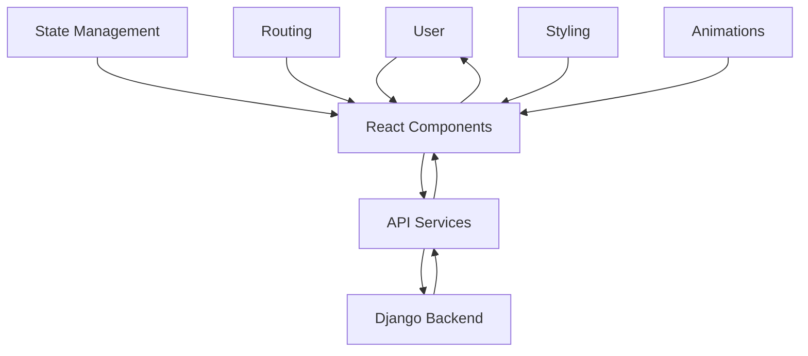

# CodeDoc Frontend - Complete Technical Explanation

## 🎯 **High-Level Overview**

### **What is the Frontend?**
The CodeDoc frontend is a modern React application that provides an intuitive, beautiful interface for users to interact with the AI-powered documentation generation system. It's designed to make complex technical operations feel simple and engaging.

### **Frontend Purpose**
The frontend serves as the user's window into CodeDoc. It:
- **Provides a stunning landing page** that explains the product and converts visitors
- **Handles user authentication** with GitHub OAuth and traditional login
- **Manages repository synchronization** with visual feedback and progress tracking
- **Displays documentation generation** with real-time progress updates
- **Offers a modern dashboard** with intuitive navigation and beautiful UI

### **Frontend ↔ Backend Connection**
```
React Frontend (Port 5173) ←→ Django Backend (Port 8000)
    ↓
1. User interacts with React components
2. React makes HTTP requests to Django API
3. Django processes requests and returns JSON
4. React updates UI based on responses
5. User sees real-time updates and feedback
```

### **Simple System Flow**


---

## 📁 **Project Structure Breakdown**

### **Root Level**
```
frontend/
├── src/                    # Main source code
├── public/                 # Static assets
├── package.json           # Dependencies and scripts
├── vite.config.js         # Build configuration
├── tailwind.config.js     # Styling configuration
└── index.html             # Entry point
```

### **src/ - Main Application Code**
Think of this as the "brain" of your React application.

- **`main.jsx`** - Application entry point (like `main()` in other languages)
- **`App.jsx`** - Root component with routing setup
- **`index.css`** - Global styles and CSS variables
- **`lib/utils.js`** - Utility functions and helpers

### **src/components/ - Reusable UI Components**
Organized by feature and purpose:

- **`ui/`** - Generic, reusable components (buttons, cards, etc.)
- **`landing/`** - Landing page specific components
- **`dashboard/`** - Dashboard specific components
- **`layout/`** - Layout and navigation components
- **`common/`** - Shared components (error boundaries, etc.)
- **`repository/`** - Repository management components

### **src/pages/ - Page Components**
Each page is a top-level component:

- **`LandingPage.jsx`** - Marketing landing page
- **`auth/`** - Authentication pages (login, signup, verify)
- **`dashboard/`** - Dashboard pages (overview, repositories, documentation, profile)

### **src/services/ - API Integration**
Handles all communication with the backend:

- **`api.js`** - Base API client configuration
- **`authService.js`** - Authentication-related API calls
- **`repositoryService.js`** - Repository and documentation API calls

### **src/contexts/ - State Management**
Global state management using React Context:

- **`AuthContext.jsx`** - User authentication state and methods

### **src/hooks/ - Custom React Hooks**
Reusable logic and state management:

- Custom hooks for common patterns

---

## 🔄 **Flow of Execution - Step by Step**

### **Example: User Generates Documentation**

Let's trace what happens when a user clicks "Generate Documentation":

#### **1. User Interaction**
```jsx
// User clicks button in QuickActions component
<button onClick={() => navigate('/dashboard/documentation')}>
  Generate Documentation
</button>
```

#### **2. Navigation**
```jsx
// React Router handles navigation
<Route path="documentation" element={<Documentation />} />
```

#### **3. Component Mounting**
```jsx
// Documentation component loads
const Documentation = () => {
  const [state, setState] = useState({
    jobs: [],
    repositories: [],
    loading: true,
    error: null
  })

  // Fetch data on mount
  useEffect(() => {
    Promise.all([
      fetchDocumentationJobs(),
      fetchReadyRepositories()
    ])
  }, [])
}
```

#### **4. API Call**
```jsx
// Service layer makes HTTP request
const fetchDocumentationJobs = async () => {
  try {
    const response = await repositoryService.getDocumentationJobs()
    setState(prev => ({ ...prev, jobs: response.documentation_jobs }))
  } catch (error) {
    setState(prev => ({ ...prev, error: error.message }))
  }
}
```

#### **5. State Update & Re-render**
```jsx
// React updates the UI based on new state
{state.jobs.map(job => (
  <JobCard key={job.id} job={job} />
))}
```

### **React Component Lifecycle**
Every component follows this pattern:
```
Mount → Render → Effects → User Interaction → State Update → Re-render
```

---

## 🚀 **Core Features & Their Flows**

### **1. Authentication System**
**What it does:** Handles user login, signup, and GitHub OAuth integration.

**Flow:**
1. User visits login page (`LoginPage.jsx`)
2. User enters credentials or clicks "Login with GitHub"
3. `AuthContext` manages authentication state
4. API calls are made through `authService.js`
5. Token is stored in localStorage
6. User is redirected to dashboard

**Key Components:**
- `AuthContext.jsx` - Global auth state management
- `LoginPage.jsx` - Login form and GitHub OAuth
- `CallbackPage.jsx` - Handles OAuth callback
- `ProtectedRoute.jsx` - Guards protected pages

### **2. Landing Page Experience**
**What it does:** Converts visitors into users with compelling marketing content.

**Flow:**
1. User visits root URL (`/`)
2. `LandingPage.jsx` renders with multiple sections
3. Each section (`ActOne`, `ActTwo`, `ActThree`) has animations
4. User clicks "Get Started" → navigates to login

**Key Components:**
- `ActOne.jsx` - Hero section with animated text
- `ActTwo.jsx` - Code comparison demo
- `ActThree.jsx` - Feature showcase
- `DecodeText.jsx` - Animated text effects
- `FunctionDemo.jsx` - Interactive code examples

### **3. Dashboard Navigation**
**What it does:** Provides intuitive navigation between different sections.

**Flow:**
1. User logs in → redirected to `/dashboard`
2. `DashboardLayout.jsx` renders sidebar and main content
3. `Outlet` renders child routes (overview, repositories, etc.)
4. Active route is highlighted in sidebar

**Key Components:**
- `DashboardLayout.jsx` - Main layout with sidebar
- `ProtectedRoute.jsx` - Ensures user is authenticated
- React Router handles URL changes

### **4. Repository Management**
**What it does:** Allows users to sync and manage GitHub repositories.

**Flow:**
1. User visits `/dashboard/repositories`
2. `Repositories.jsx` loads and fetches repository data
3. User can sync repositories from GitHub
4. User can select repositories for documentation
5. Real-time updates show sync progress

**Key Components:**
- `RepositorySync.jsx` - Repository synchronization
- `GitHubConnectionStatus.jsx` - Connection status display
- `repositoryService.js` - API calls for repository operations

### **5. Documentation Generation**
**What it does:** Manages the AI-powered documentation generation process.

**Flow:**
1. User visits `/dashboard/documentation`
2. System shows available repositories and past jobs
3. User selects repository and clicks "Generate"
4. Background job is created via API
5. Real-time progress updates every 5 seconds
6. User can view and download generated documentation

**Key Components:**
- `Documentation.jsx` - Main documentation page
- `DocumentationViewer.jsx` - Displays generated docs
- Auto-refresh logic for active jobs

### **6. Real-time Updates**
**What it does:** Provides live feedback for long-running operations.

**Flow:**
1. Component sets up interval for active jobs
2. Every 5 seconds, API is called to check status
3. UI updates with new progress information
4. When job completes, interval is cleared

**Implementation:**
```jsx
useEffect(() => {
  const activeJobs = state.jobs.filter(job =>
    job.status === 'pending' || job.status === 'processing'
  )

  if (activeJobs.length > 0) {
    const interval = setInterval(fetchDocumentationJobs, 5000)
    return () => clearInterval(interval)
  }
}, [state.jobs])
```

---

## 📚 **Libraries & Why They're Used**

### **Core React Stack**
- **React 19.1.0** - UI library for building component-based interfaces
  - *Why chosen:* Declarative, component-based, excellent ecosystem
  - *Benefits:* Virtual DOM, hooks, context API, excellent developer experience

- **React Router DOM 7.8.1** - Client-side routing
  - *Why needed:* Single-page application navigation
  - *Benefits:* URL-based navigation, nested routes, route protection

### **Build Tools & Development**
- **Vite 7.0.4** - Build tool and development server
  - *Why chosen:* Extremely fast hot reload, modern ES modules
  - *Benefits:* Instant server start, lightning-fast builds

- **ESLint 9.30.1** - Code linting and formatting
  - *Why needed:* Maintain code quality and consistency
  - *Benefits:* Catches errors early, enforces best practices

### **Styling & UI**
- **Tailwind CSS 3.4.17** - Utility-first CSS framework
  - *Why chosen:* Rapid development, consistent design system
  - *Benefits:* No CSS conflicts, responsive design utilities, dark mode support

- **Framer Motion 12.23.12** - Animation library
  - *Why needed:* Smooth, professional animations
  - *Benefits:* Declarative animations, gesture support, performance optimized

- **Lucide React 0.540.0** - Icon library
  - *Why chosen:* Beautiful, consistent icons
  - *Benefits:* Tree-shakable, customizable, excellent variety

### **UI Components & Utilities**
- **Radix UI** - Headless UI components
  - *Why needed:* Accessible, unstyled components
  - *Benefits:* Built-in accessibility, customizable styling

- **Class Variance Authority** - Component variant management
  - *Why needed:* Type-safe component variants
  - *Benefits:* Consistent component APIs, better TypeScript support

- **clsx & tailwind-merge** - Class name utilities
  - *Why needed:* Conditional styling and class merging
  - *Benefits:* Clean conditional classes, no conflicts

### **HTTP & API**
- **Axios 1.11.0** - HTTP client
  - *Why chosen:* Promise-based, interceptors, better error handling
  - *Benefits:* Request/response interceptors, automatic JSON parsing

---

## ⚠️ **Error Handling & User Experience**

### **Error Boundary Strategy**
The application uses React Error Boundaries to catch and handle errors gracefully:

```jsx
class ErrorBoundary extends React.Component {
  constructor(props) {
    super(props)
    this.state = { hasError: false, error: null }
  }

  static getDerivedStateFromError(error) {
    return { hasError: true, error }
  }

  componentDidCatch(error, errorInfo) {
    console.error('Error Boundary caught an error:', error, errorInfo)
  }

  render() {
    if (this.state.hasError) {
      return (
        <div className="min-h-[400px] flex items-center justify-center">
          <div className="text-center">
            <AlertCircle className="w-12 h-12 text-destructive mx-auto mb-4" />
            <h2 className="text-lg font-semibold text-foreground mb-2">
              Something went wrong
            </h2>
            <button onClick={() => window.location.reload()}>
              Reload Page
            </button>
          </div>
        </div>
      )
    }

    return this.props.children
  }
}
```

### **API Error Handling**
Centralized error handling through Axios interceptors:

```jsx
// Response interceptor for error handling
apiClient.interceptors.response.use(
  (response) => response,
  (error) => {
    if (error.response?.status === 401) {
      // Token is invalid/expired
      localStorage.removeItem('token')
      window.location.href = '/login'
    }
    return Promise.reject(error)
  }
)
```

### **Loading States**
Every async operation shows appropriate loading states:

```jsx
const [loading, setLoading] = useState(true)

// In component
{loading ? (
  <div className="flex items-center justify-center h-64">
    <div className="animate-spin rounded-full h-12 w-12 border-b-2 border-primary"></div>
  </div>
) : (
  // Actual content
)}
```

### **User Feedback**
- **Success messages** for completed operations
- **Error messages** with clear explanations
- **Progress indicators** for long-running tasks
- **Toast notifications** for quick feedback

---

## 🎨 **Styling & Design System**

### **CSS Architecture**
The application uses a sophisticated styling approach:

#### **1. Tailwind CSS Base**
```css
@tailwind base;
@tailwind components;
@tailwind utilities;
```

#### **2. CSS Variables for Theming**
```css
:root {
  --background: 220 40% 8%;    /* Deep Navy Blue */
  --foreground: 220 15% 95%;   /* Cool Off-White */
  --primary: 210 80% 70%;      /* Silvery Blue */
  --card: 220 40% 12%;         /* Card Background */
  --border: 220 30% 20%;       /* Border Color */
}
```

#### **3. Custom Component Classes**
```css
.glow-button {
  position: relative;
  background: white;
  color: #18181b;
  border: 2px solid white;
  font-weight: 600;
  padding: 1.5rem 2rem;
  border-radius: 0.5rem;
  transition: all 300ms ease;
}

.glow-button:hover {
  background: rgba(255, 255, 255, 0.9);
  box-shadow: 
    0 0 30px rgba(255, 255, 255, 0.4),
    0 0 60px rgba(255, 255, 255, 0.2);
}
```

### **Design System Components**

#### **1. Feature Cards**
```jsx
const FeatureCard = ({ icon: Icon, title, description, index }) => {
  return (
    <motion.div
      className="group relative p-6 rounded-lg border border-border/50 hover:border-primary/30"
      initial={{ opacity: 0, y: 30 }}
      whileInView={{ opacity: 1, y: 0 }}
      transition={{ duration: 0.6, delay: index * 0.1 }}
      whileHover={{ y: -5 }}
    >
      <div className="mb-4 p-3 rounded-lg bg-primary/10 w-fit">
        <Icon className="w-6 h-6 text-primary" />
      </div>
      <h3 className="text-lg font-semibold mb-2 text-foreground">
        {title}
      </h3>
      <p className="text-sm text-muted-foreground leading-relaxed">
        {description}
      </p>
    </motion.div>
  )
}
```

#### **2. Stats Cards**
```jsx
const StatsCard = ({ title, value, icon: Icon, trend, trendUp }) => {
  return (
    <motion.div
      className="bg-card border border-border rounded-lg p-6 hover:border-primary/30"
      whileHover={{ y: -2 }}
    >
      <div className="flex items-center justify-between">
        <div>
          <p className="text-sm font-medium text-muted-foreground mb-2">
            {title}
          </p>
          <p className="text-3xl font-bold text-foreground font-mono">
            {typeof value === 'number' ? value.toLocaleString() : value}
          </p>
        </div>
        <div className="p-3 bg-primary/10 border border-primary/20 rounded-lg">
          <Icon className="w-6 h-6 text-primary" />
        </div>
      </div>
    </motion.div>
  )
}
```

### **Animation System**
Framer Motion provides sophisticated animations:

#### **1. Scroll-triggered Animations**
```jsx
const { scrollYProgress } = useScroll({
  target: ref,
  offset: ["start end", "end start"]
})

const opacity = useTransform(scrollYProgress, [0, 0.3, 0.7, 1], [0, 1, 1, 0])
```

#### **2. Interactive Animations**
```jsx
<motion.button
  whileHover={{ scale: 1.02 }}
  whileTap={{ scale: 0.98 }}
  initial={{ opacity: 0, y: 20 }}
  animate={{ opacity: 1, y: 0 }}
  transition={{ duration: 0.6, ease: [0.22, 1, 0.36, 1] }}
>
  Click me
</motion.button>
```

#### **3. Text Animation Effects**
```jsx
const DecodeText = ({ text, className = "", delay = 0 }) => {
  const [decodedText, setDecodedText] = useState('')
  const [isDecoding, setIsDecoding] = useState(false)
  
  const chars = 'ABCDEFGHIJKLMNOPQRSTUVWXYZ0123456789@#$%^&*'
  
  useEffect(() => {
    // Complex text decoding animation logic
    // Creates a "hacker" effect where text appears to decode
  }, [text, delay])
  
  return (
    <motion.span 
      className={`${className} ${isDecoding ? 'text-primary' : ''}`}
      initial={{ opacity: 0 }}
      animate={{ opacity: 1 }}
    >
      {decodedText || text}
    </motion.span>
  )
}
```

---

## 🎓 **Step-by-Step Teaching Examples**

### **Example 1: Understanding React Components**

Think of React components like **Lego blocks** - each piece has a specific purpose and can be combined to build complex structures:

```jsx
// Simple component (like a basic Lego block)
const Button = ({ children, onClick }) => {
  return (
    <button 
      onClick={onClick}
      className="px-4 py-2 bg-primary text-white rounded-lg"
    >
      {children}
    </button>
  )
}

// Complex component (like a complex Lego structure)
const Dashboard = () => {
  const [data, setData] = useState(null)
  
  useEffect(() => {
    fetchData().then(setData)
  }, [])
  
  return (
    <div className="dashboard">
      <Header />
      <Sidebar />
      <MainContent data={data} />
      <Footer />
    </div>
  )
}
```

### **Example 2: Understanding State Management**

State is like **memory** for your components - it remembers what the user has done:

```jsx
// Local state (like short-term memory)
const [count, setCount] = useState(0)

// Global state (like long-term memory)
const { user, login, logout } = useAuth()

// Derived state (like calculations based on memory)
const isAuthenticated = !!user && !!token
```

### **Example 3: Understanding API Calls**

API calls are like **sending letters** to the backend and waiting for responses:

```jsx
// Sending a letter (API request)
const sendLetter = async (message) => {
  try {
    // 1. Write the letter (prepare request)
    const letter = {
      to: '/api/users/login/',
      content: { username: 'john', password: 'secret' }
    }
    
    // 2. Send the letter (make API call)
    const response = await apiClient.post(letter.to, letter.content)
    
    // 3. Read the response (handle success)
    console.log('Response received:', response.data)
    return response.data
    
  } catch (error) {
    // 4. Handle if letter gets lost (handle error)
    console.error('Letter was lost:', error.message)
    throw error
  }
}
```

### **Example 4: Understanding Routing**

Routing is like **having a map** that tells users where they are and how to get somewhere else:

```jsx
// The map (route definitions)
<Routes>
  <Route path="/" element={<LandingPage />} />
  <Route path="/login" element={<LoginPage />} />
  <Route path="/dashboard" element={<DashboardLayout />}>
    <Route path="overview" element={<Overview />} />
    <Route path="repositories" element={<Repositories />} />
  </Route>
</Routes>

// Navigation (telling the map where to go)
const navigate = useNavigate()
navigate('/dashboard/overview') // "Go to overview page"
```

---

## ❓ **Common Questions Interviewers/Professors Might Ask**

### **Q: Why did you choose React over Vue or Angular?**
**A:** React was chosen for several reasons:
- **Ecosystem**: Largest ecosystem with excellent libraries and tools
- **Learning Curve**: Easier to learn and onboard new developers
- **Flexibility**: Less opinionated, allows more architectural choices
- **Performance**: Virtual DOM and modern React features provide excellent performance
- **Community**: Massive community support and resources

### **Q: How do you handle state management without Redux?**
**A:** We use React's built-in state management:
1. **useState** for local component state
2. **useContext** for global state (authentication)
3. **Props** for parent-child communication
4. **Custom hooks** for reusable state logic

This approach is simpler and more maintainable for our application size. Redux would be overkill.

### **Q: How do you ensure good performance?**
**A:** Multiple performance optimization strategies:
1. **Code Splitting**: Lazy loading of routes and components
2. **Memoization**: React.memo and useMemo for expensive calculations
3. **Virtual Scrolling**: For large lists (if needed)
4. **Image Optimization**: Proper sizing and lazy loading
5. **Bundle Analysis**: Regular bundle size monitoring
6. **Tree Shaking**: Only import what's needed

### **Q: How do you handle responsive design?**
**A:** Tailwind CSS provides excellent responsive utilities:
```jsx
// Mobile-first approach
<div className="w-full md:w-1/2 lg:w-1/3">
  <h1 className="text-2xl md:text-3xl lg:text-4xl">
    Responsive Title
  </h1>
</div>
```

We also use CSS Grid and Flexbox for complex layouts.

### **Q: How do you test your React components?**
**A:** Testing strategy includes:
1. **Unit Tests**: Test individual components in isolation
2. **Integration Tests**: Test component interactions
3. **E2E Tests**: Test complete user workflows
4. **Visual Regression Tests**: Ensure UI consistency
5. **Accessibility Tests**: Ensure components are accessible

### **Q: How do you handle authentication security?**
**A:** Multiple security layers:
1. **Token Storage**: Secure localStorage with automatic cleanup
2. **Route Protection**: ProtectedRoute component guards sensitive pages
3. **API Interceptors**: Automatic token injection and error handling
4. **OAuth Flow**: Secure GitHub OAuth integration
5. **Error Handling**: Graceful handling of auth failures

### **Q: How do you manage API calls and caching?**
**A:** API management strategy:
1. **Centralized Service Layer**: All API calls go through service files
2. **Axios Interceptors**: Automatic token handling and error management
3. **Request Deduplication**: Prevent duplicate API calls
4. **Optimistic Updates**: Update UI immediately, sync with server
5. **Error Boundaries**: Graceful error handling at component level

### **Q: How do you ensure accessibility?**
**A:** Accessibility is built into our components:
1. **Semantic HTML**: Proper use of HTML elements
2. **ARIA Labels**: Screen reader support
3. **Keyboard Navigation**: Full keyboard accessibility
4. **Color Contrast**: WCAG compliant color schemes
5. **Focus Management**: Proper focus indicators and management

### **Q: How do you handle animations and transitions?**
**A:** Framer Motion provides sophisticated animation capabilities:
1. **Performance**: Hardware-accelerated animations
2. **Accessibility**: Respects user's motion preferences
3. **Declarative**: Easy to understand and maintain
4. **Gesture Support**: Touch and mouse interactions
5. **Spring Physics**: Natural-feeling animations

### **Q: How would you scale this frontend?**
**A:** Scaling strategy:
1. **Code Splitting**: Lazy load routes and components
2. **Micro-frontends**: Split into smaller applications if needed
3. **State Management**: Consider Redux for complex state
4. **Caching**: Implement service workers for offline support
5. **CDN**: Serve static assets from CDN
6. **Monitoring**: Add performance and error monitoring

---

## 🎯 **Summary: What Makes This Frontend Special**

1. **Modern Architecture**: React 19, Vite, Tailwind CSS, Framer Motion
2. **Beautiful Design**: Custom dark theme with sophisticated animations
3. **Excellent UX**: Intuitive navigation, real-time feedback, smooth transitions
4. **Performance Optimized**: Code splitting, lazy loading, efficient rendering
5. **Accessible**: WCAG compliant, keyboard navigation, screen reader support
6. **Developer Experience**: Hot reload, excellent tooling, clean code structure

This isn't just a functional interface - it's a delightful user experience that makes complex technical operations feel simple and engaging.

**By understanding this frontend, you've learned:**
- Modern React patterns and best practices
- Component-based architecture design
- State management with Context API
- API integration and error handling
- Responsive design with Tailwind CSS
- Animation and interaction design
- Performance optimization techniques
- Accessibility implementation

You're now ready to explain this frontend system confidently to anyone! 🚀
